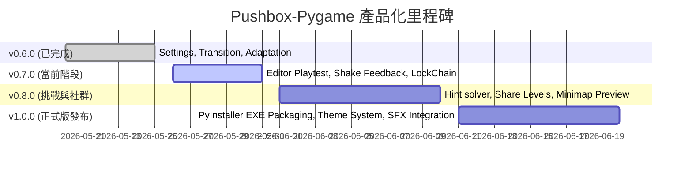
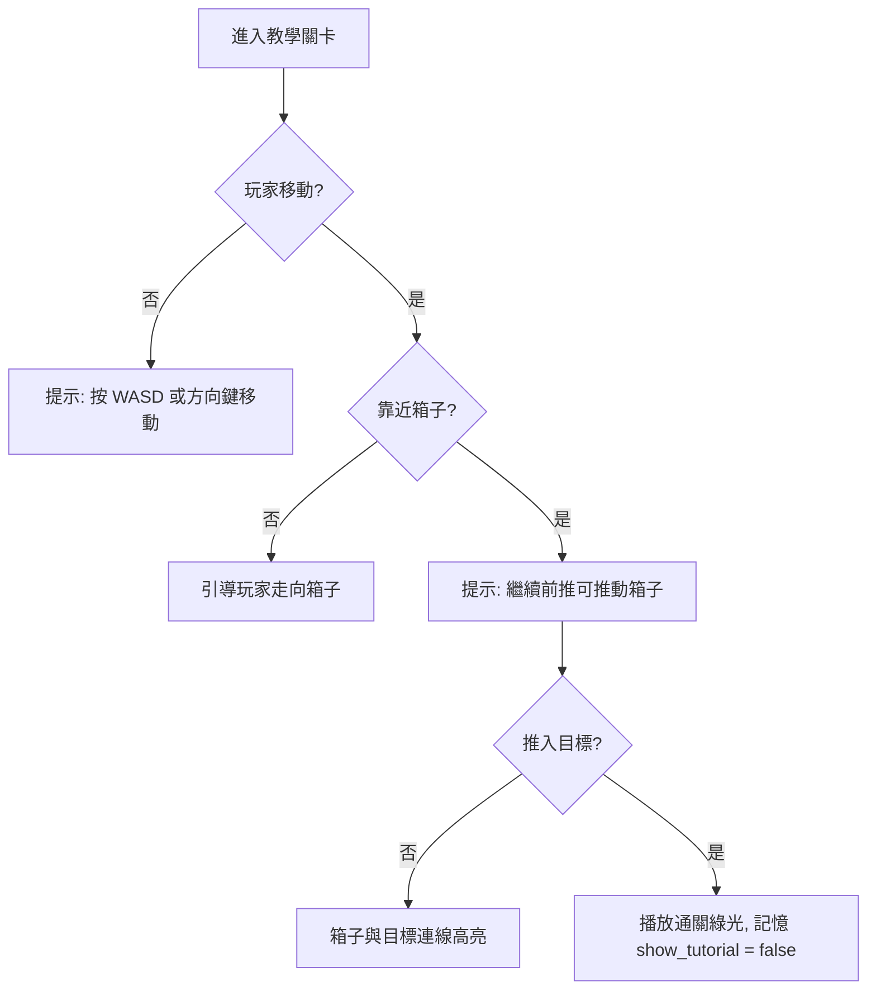

# Development Guide & Product Roadmap

## Prerequisites

- Python 3.9+
- `uv` installed (recommended)
- A desktop environment for running Pygame

## Install Dependencies

```bash
uv sync
uv sync --extra dev
```

Fallback (if `uv` is not available):

```bash
python -m venv .venv
.venv\Scripts\activate
pip install -e ".[dev]"
```

## Run the Game

```bash
uv run python main.py
```

## Tests

```bash
uv run python -m pytest
```

## Lint and Format

```bash
uv run ruff check .
uv run ruff format .
```

## Type Check

```bash
uv run mypy src/
```

## Suggested Workflow

1. Sync dependencies with `uv sync`
2. Run the game to reproduce or validate changes
3. Update or add tests as needed
4. Run `ruff` and `mypy` before committing

## Runtime Data and Caches

- Runtime progress files are stored in `data/progress.json` and `data/config.json`
- These files are gitignored; default templates live in `src/pushbox/utils/config.py`
- Local caches are stored in `.pytest_cache/`, `.ruff_cache/`, and `.mypy_cache/`
- Local environments live in `.venv/`

## Troubleshooting

- If Pygame fails to initialize, verify you have a desktop session or run headless with virtual display.
- If `uv sync` fails, use the fallback pip install steps above.

---

# 產品 / UI/UX 深度審計與體驗優化報告（v0.6.0）

> **編者按**：本報告由產品工程師（Product Engineer）與 UI/UX 設計師的雙重專業角度出發，針對目前的 Pushbox-Pygame 進行全面性的產品化審計（Product Audit）。
> 我們深入評估了遊戲從「功能 Demo」跨越至「正式發布產品（Casual Game Product）」在體驗、視覺、互動、引導、沉浸感等維度的表現，並提出了具體的優化清單與工程實現架構，旨在為專案的下一階段迭代提供精準的開發指南。

---

## 一、九大體驗面向深度評估（Core UX Audit）

### 1.1 新手首次進入 App 的體驗完整性
* **現狀評估**：
  在 v0.6.0 中，我們成功導入了 `show_tutorial` 的記憶機制。首次啟動時，應用程式會先強制引導至「操作教學畫面」（`TutorialScreen`），當用戶按下任意鍵後，該狀態會被永久記錄於 `config.json`，後續重開便直達主選單。
* **痛點分析**：
  雖然解決了「每次啟動皆被教學打擾」的痛點，但目前的引導仍屬於「**靜態說明圖**」形式。對於沒有推箱子經驗的年輕一代或輕度玩家，面對一張寫滿按鍵與規則的圖，可能產生認知負荷，無法快速將視覺資訊轉化為操作直覺。
* **改善建議**：
  應將靜態圖改為「**交互式新手關卡**」（見 5.1 節）。

### 1.2 首頁與功能選單是否清楚易懂
* **現狀評估**：
  主選單採用了簡潔的暗色系卡片佈局，按鈕的字型、尺寸與排列具有極佳的視覺對比。v0.6.0 新增了「當前通關進度（★ 已完成 X / 30 關）」與「版本號標章」，大幅提升了產品的 Branding（品牌感）。鍵盤與滑鼠雙支援的設計使得無障礙導覽非常健全。
* **痛點分析**：
  主選單的背景網格是靜態的，且畫面缺乏動態生命力。按鈕的 Hover 狀態雖有底色加深，但缺乏物理彈性與微動效。
* **改善建議**：
  - 設計「吸引模式（Attract Mode）」背景：在主選單背景以 15% 不透明度自動播放預錄的關卡 AI 求解動畫，或讓隨機的箱子、小人、綠色目標點在背景進行慢速物理飄浮與旋轉。
  - 為 `ModernButton` 增加 Hover 時的輕微向上平移（1-2px）與邊框漸變動畫，強化微互動反饋。

### 1.3 遊戲介紹、主題分類與操作教學是否足夠
* **現狀評估**：
  目前專案完全聚焦於「純益智推箱子」幾何解謎，無任何故事背景包裝。這高度符合經典休閒益智遊戲（如 Sokoban、Sliding Puzzle）的簡潔定位，使玩家能專注於邏輯思考。
* **痛點分析**：
  雖然不需要強加複雜的劇情或故事背景，但目前「完全沒有關卡包分組與主題視覺區隔」會削弱長線通關動力。玩家面對 30 個純數字關卡，難以獲得「系列解鎖」的滿足感。
* **改善建議**：
  - **關卡分組主題化（Puzzle Theme Packs）**：將預設關卡分為三大主題包，如「`綠野初探 (Classic Garden)`」、「`極光冰川 (Nordic Glacier)`」與「`德古拉之夜 (Dracula Night)`」，為每個主題包設定獨特的配色方案（如經典綠、Nord 冰雪藍、Dracula 亮紫）。
  - **漸進式引導文案**：關卡加載時，在畫面中央淡入淡出顯示一些簡短、激勵思考的名言或邏輯提示，以低成本提升遊戲質感。

### 1.4 UI 視覺層級與操作流程是否直覺
* **現狀評估**：
  得益於 Dracula/Nord 暗色美學，視覺層級劃分十分清晰：牆壁具有偽 3D 立體投影，箱子被推入目標點時，會從灰藍色瞬間點亮為亮綠色。遊戲的狀態流程（首頁 -> 關卡選擇 -> 遊戲中 -> 暫停/設定 -> 順暢進入下一關）完全符合直覺。
* **痛點分析**：
  - 當玩家站在箱子旁時，缺乏方向性的交互提示（例如不知道哪邊是死角、哪邊可推）。
  - 通關時的「勝利煙火/粒子」雖然做了自適應優化，但粒子發散方式較為單一，通關時的「成就感反饋」不夠飽滿。
* **改善建議**：
  - 當玩家角色貼近箱子且該方向可以推動時，箱子對應的邊緣可以產生極其微弱的箭頭呼吸燈，引導操作。
  - 大幅升級勝利慶祝畫面：通關瞬間畫面背景微弱變暗，高亮顯示「通關紀錄對比」，加入「三星評價（★ ★ ★）」動畫以順序彈出，並伴隨炫目的粒子爆裂。

### 1.5 功能切換與頁面導覽是否合理
* **現狀評估**：
  v0.6.0 的 Full-screen Fade Transition 完美解決了場景切換的突兀黑屏問題。在暫停選單（Pause Overlay）中點擊設定，可以無縫在遊戲狀態和設定選單中切換。
* **痛點分析**：
  - **關卡編輯器 (Level Editor) 體驗割裂**：編輯自訂關卡後，無法立刻驗證其可解性。必須保存 -> 退出至主選單 -> 進入關卡選擇器 -> 翻頁至自訂關卡 -> 開始遊玩。此路徑包含高達 5 次以上的畫面跳轉與操作，嚴重拖慢關卡創作者的效率。
  - **編輯器退出防呆缺失**：在編輯器中按下 Esc 鍵或點擊退出，若地圖有未保存的修改，會直接被捨棄，沒有任何二次確認，極易造成玩家勞動成果的意外丟失。
* **改善建議**：
  - 在 Level Editor 的側邊欄中加入「**一鍵試玩 (Play Test)**」按鈕。點擊後以暫時的 `GameState` 原地啟動遊戲，按下 Esc 可直接退回編輯器，實現秒級迭代。
  - 實作防呆確認框（Confirmation Dialog），偵測地圖是否為 Dirty 狀態，退出時彈窗提示：「有未儲存的關卡變更，確定要退出嗎？」。

### 1.6 是否缺少設定頁、存檔機制、音效控制、提示系統等基礎功能
* **現狀評估**：
  - **設定頁**：已完整實作，功能齊備。
  - **存檔機制**：已實作自動存檔與歷史最佳紀錄比對。
  - **音效控制**：UI 設定已備妥，底層 API 為 Stub 空殼（保留中）。
  - **提示系統 (Hint System) — ❌ 完全缺失**：
* **痛點分析**：
  益智解謎遊戲在第 15 關以後難度大幅攀升，一旦玩家在某個關卡死鎖或卡關超過 10 分鐘，且沒有任何提示，有 80% 的玩家會選擇直接關閉並移除遊戲。**提示系統是將遊戲從「技術 Demo」推向「大眾市場正式產品」的靈魂功能。**
* **改善建議**：
  - 技術上可利用 BFS（廣度優先搜尋）或 A* 演算法在後台即時計算當前盤面的最優解路徑（推箱子 Solver）。
  - 在遊戲 HUD 新增一個「💡 提示」按鈕，點擊後，以半透明虛影或發光路徑標示「下一個推薦推動的箱子以及推動方向」。每天或每局限制使用次數，或可通過通關獲取提示次數。

### 1.7 是否需要加入新手引導（Onboarding）
* **現狀評估**：
  極度需要。休閒遊戲的頭 30 秒決定了留存率。
* **改善建議**：
  將關卡 1（Level 1）設計為「強制互動教學關」。此關卡中：
  - 地圖極簡（一個玩家、一個箱子、一個相距 2 格的目標點，無死角）。
  - 在玩家未移動前，畫面上方顯示「按下 W/A/S/D 或方向鍵移動」。
  - 當玩家移動並靠近箱子時，顯示「走到箱子旁，繼續向前推動它」。
  - 當玩家將箱子推到目標點上時，彈出「目標點變為綠色，通關！」。
  完成此關後，再釋放所有介面操作。

### 1.8 是否有能提升沉浸感與遊戲感的設計
* **現狀評估**：
  目前操作缺乏「打擊感/回饋感」（Game Feel / Juiciness）。移動、撞牆與推箱子在視覺上的動能反饋完全一致，顯得機械化。
* **改善建議**：
  - **無效操作反饋**：撞牆、推雙重箱子、或向死角推動時，整個遊戲網格產生一瞬間的「微小水平震動（Screen Shake）」，並伴隨玩家角色頭上出現氣泡（如「！」或汗滴標記）。
  - **箱子歸位特效**：當箱子被推上 Target 的瞬間，觸發一次局部「綠色粒子微爆發（Particle Burst）」與目標點的呼吸波紋。
  - **撤銷/重做過渡**：按 Z 撤銷時，角色和箱子不要生硬瞬移，而是以 100ms 的極速插值平滑滑回前一個格子，創造時光倒流的精緻視覺感。

### 1.9 App 是否具備「正式產品」而非「功能 Demo」的體驗
* **現狀評估**：
  在 v0.6.0 完成後，我們的核心機制、設定保存、自適應視窗已完全達到正式產品水準。然而，**「分發與關卡鏈結」**仍具備 Demo 感：
  1. 需要通過終端執行命令行啟動。
  2. 關卡選擇器支援任意跳關，沒有前置關卡鎖定，缺乏漸進的成就感。
  3. 沒有一個優雅的「關於遊戲與開發團隊」展示。
* **改善建議**：
  - 使用 PyInstaller 進行 Windows 二進位封裝，並整合特製的現代簡約像素幾何風格 App Icon，提供一鍵運行的 `.exe` 安裝/免裝包。
  - 實作關卡鎖定：通關第 N 關才能解鎖第 N+1 關，已解鎖的關卡才能在 Level Selector 中被選中。
  - 主選單底端加上極其精緻的「© 2026 Antigravity / Pushbox Studio」版權與鳴謝字樣。

---

## 二、待辦事項（TODO Roadmap）

### 2.1 P1 — 基礎設施與核心體驗優化 (v0.6.0 已完美交付)
- [x] **遊戲設定頁 (Settings Screen)**：實現鍵鼠雙控、暗色玻璃風格、設定即時存檔。
- [x] **自適應動態格線**：解決大型關卡（如 20x20）在小解析度視窗下溢出裁剪的問題。
- [x] **場景淡入淡出 (Fade Transitions)**：消除介面切換時的生硬閃爍。
- [x] **首頁進度與版本徽章**：主選單顯示通關進度，Branding 細節化。
- [x] **歷史紀錄對比**：通關顯示「歷史最佳步數/時間」，建立心流激勵。
- [x] **無頭劇本冒煙測試**：確保整個 UI 與 Core 狀態機在各種極端交互下 0 Crash。

### 2.2 P2 — 介面細節與體驗拋光（建議本階段優先處理）
- [x] **編輯器「一鍵試玩」按鈕**：側邊欄新增 `Play Test`，支援從當前未存檔網格無縫切換至臨時 PlayState，Esc 一鍵返回。
- [x] **編輯器退出防呆警告**：若關卡被編輯且未儲存，按下 Esc 退出時，彈窗二次確認。
- [x] **無效操作 Screen Shake 震動**：撞牆、推雙箱時觸發棋盤 3-5 像素的極速抖動。
- [x] **箱子歸位粒子爆發**：箱子落入目標點時，在該 Cell 觸發 15 幀 of 綠色發光粒子擴散。
- [x] **首頁「吸引模式」背景**：主選單背景慢速播放半透明的 AI 自動推箱子動畫。

### 2.3 P3 — 產品化與遊戲感延伸項目
- [x] **多套關卡主題配色包 (Visual Theme Packs)**：實現經典綠、Nord 冰雪藍、Dracula 暗紫等視覺風格的實時切換與渲染。
- [x] **關卡鎖定解鎖鏈**：實作關卡解鎖進度（只有通關前一關，下一關卡片才變為 Active 解鎖狀態）。
- [x] **微縮關卡預覽 (Minimap Preview)**：在關卡選擇器右側，選中某關卡時渲染該地圖的 80x80 超微縮格線圖。
- [x] **時光倒流插值平滑**：撤銷 (Z) 與重做 (Y) 時，角色與箱子以 100ms 短動畫平滑滑動，而非瞬移。

---

## 三、中長期版本規劃（Milestones）



### 🎯 v0.7.0 — 交互反饋、多主題與平滑動畫 (當前版本)
* 實作 Level Editor「一鍵試玩 (Play Test)」與「未儲存防呆警告」。 [已完成]
* 實作無效操作「畫面微震動（Screen Shake）」與歸位「發光粒子（Cell Particle Spark）」。 [已完成]
* 實作預設 30 個關卡的「循序解鎖鏈」與「微縮關卡預覽 (Minimap Preview)」。 [已完成]
* 實作「多套主題配色包 (Visual Theme Packs)」實時換色。 [已完成]
* 實作「時光倒流插值平滑 (Smooth Undo/Redo)」100ms 短動畫。 [已完成]

### 🎯 v0.8.0 — 智慧提示系統、互動教學與社群分享 (當前階段)
* 實作 **互動式 Onboarding 新手教學關卡**，以引導式操作取代靜態圖卡說明。 [已完成]
* 實作 **後台 A* / BFS 最短行動路徑智慧求解引擎**，在卡關時提供 `I` 鍵提示與發光路徑。 [已完成]
* 支援自訂關卡 `zlib-base64` 壓縮字串一鍵匯出，並加載 8 點嚴苛防禦性驗證機制支援匯入社群分享。 (未開始)

### 🎯 v1.0.0 — 發布級獨立遊戲 (Release Candidate)
* 透過 PyInstaller 封裝為 **Windows 獨立執行檔 (`.exe`)**，具備定制化桌面圖標。
* 音效系統底層（SFX & BGM）整合實裝與 UI 音效/音樂開關。
* 各主題（極光冰川、經典綠、德古拉暗紫）特有地面細節與視覺微裝飾。

---

## 四、UX 改進方向（UX Enhancement Proposals）

### 4.1 交互式 Onboarding 教學流程
設計一個專屬教學場景，將文字規則拆解為「動作觸發」：


### 4.2 Juicy 遊戲感（撞擊與死鎖反饋）
1. **死鎖主動提示**：當 GameState 偵測到 `GAME_OVER`（箱子推入死角且無法獲勝）時，除彈出「死鎖！」Overlay 外，被鎖死的箱子 Cell 產生微弱的紅色警戒光暈，並讓撤銷鍵 Z 產生呼吸發光，暗示玩家「時光倒流是唯一的解法」。
2. **步伐微慣性**：玩家角色在快速連續移動時，渲染精緻的 2-pixel 角色拖尾（Ghost Trail），讓 Pygame 的 2D 畫面產生現代橫版遊戲的精緻運動感。

---

## 五、技術改善方向（Technical Excellence Roadmap）

### 5.1 統一資源與字型管理器 (`FontManager`)
* **現狀問題**：目前 `Menu`、`SettingsScreen`、`Renderer` 等類別在每次實例化或重繪時都單獨調用 `pygame.font.Font()` 從硬碟載入 `.ttf` 文件，造成重複 I/O 與記憶體碎片。
* **技術方案**：
  重構並封裝一個單例（Singleton）或靜態類別 `FontManager`：
  ```python
  class FontManager:
      _fonts: dict[str, pygame.font.Font] = {}
      
      @classmethod
      def get_font(cls, path: str, size: int) -> pygame.font.Font:
          key = f"{path}_{size}"
          if key not in cls._fonts:
              cls._fonts[key] = pygame.font.Font(path, size)
          return cls._fonts[key]
  ```
  這樣可以確保全域字型僅加載一次，大幅提升啟動速度與運行時記憶體穩定性。

### 5.2 場景狀態堆疊（`SceneStateStack`）
* **現狀問題**：`main.py` 的 `GameApp` 藉由一個扁平的 `self.current_screen` 字串變數進行場景路由。當出現「在遊戲中暫停 -> 進入設定 -> 從設定返回暫停 -> 返回遊戲」這種嵌套場景時，扁平字串難以優雅維護前置狀態。
* **技術方案**：
  引入場景堆疊模式（Scene Stack Pattern）：
  - 定義 `Scene` 抽象基底類別，擁有 `handle_events(events)`, `update(dt)`, `draw(screen)` 生命週期方法。
  - `GameApp` 維持一個 `self.scene_stack: list[Scene]`。
  - 暫停或設定時，`self.scene_stack.append(SettingsScene())`（Push）。
  - 返回時，`self.scene_stack.pop()`。
  這能讓轉場動畫、音量淡入淡出、鍵盤焦點管理變得極其解耦與清晰。

---

## 六、下一步工作規劃 (Future Roadmap & Next Steps)

為了從 `v0.7.0` 跨越至 `v0.8.0` 並順利進軍 `v1.0.0` 發布版本，以下是接下來的具體執行路徑與規劃：

### 6.1 任務 1：互動式新手引導關卡 (Onboarding Level) [已完成]
* **目標**：用 100% 互動的操作引導，取代舊有首次啟動時強制的靜態說明圖。
* **做法**：
  - **動態注入**：不污染 `constants.py` 與 `DEFAULT_LEVELS` 正式 30 關卡，由 `LevelManager` 初始化時在記憶體中動態注入 5x7 教學關 `"Level 0"`。
  - **物理隔離**：在 `get_level_names()` 中剔除，使其在 `LevelSelector` 中隱形，且不影響正式 30 關完成度統計。
  - **首次引導與無縫直退**：當 `show_tutorial` 為 `True` 時，啟動後直接載入 `"Level 0"`，且在 HUD 上方動態渲染當前狀態的玻璃風格引導框（Moves=0：移動；Moves>0：走到箱子旁與推動箱子）。
  - **通關跳轉**：通關時不調用 save_manager，不觸發 win overlay 煙火與最佳紀錄，直接設定 `show_tutorial=False` 保存配置並返回主選單。主選單「教學說明」仍可進入靜態說明卡。

### 6.2 任務 2：A* / BFS 求解器與💡提示系統 (Solver & Hint System) [已完成]
* **目標**：解決玩家卡關退遊的問題，提供即時、精準的最短路徑步驟提示。
* **做法**：
  - **[已完成]** 在後台使用 Breadth-First Search (BFS) 實作一個 Sokoban 求解器，計算當前關卡從當前狀態到獲勝的最短路徑，並提供最大搜尋節點防護常數（`MAX_SOLVER_NODES = 50,000`）。
  - **[已完成]** 當玩家點擊 HUD 的「💡 提示 (I)」按鈕或按下 `I` 鍵時，如果可解，在地圖上為下一個應推動的箱子和玩家的走法以虛線或發光粒子路徑高亮顯示 1.5 秒。

### 6.3 任務 3：自訂關卡 JSON 匯出/匯入與社群分享
* **目標**：賦予自訂關卡傳播屬性，建立社群玩家的自製關卡分享鏈。
* **做法**：
  - 在 `Level Editor` 保存地圖時，支持「匯出關卡」按鈕，生成一串壓縮的 JSON Base64 字串，玩家可一鍵複製分享。
  - 在 `Level Selector` 的自訂關卡分頁中，新增「匯入關卡」輸入框，貼上分享字串即可解密載入並儲存，0 成本拓寬遊戲可玩性。

### 6.4 任務 4：音效系統實裝 (SFX & BGM Integration)
* **目標**：啟動 Stub 狀態的 `AudioManager`，為移動、撞牆、推箱子、通關、暫停實裝清脆的像素級音效與柔和背景樂。
* **做法**：
  - 將音訊檔案放置於 `assets/sounds/` 與 `assets/music/`。
  - 使用 `pygame.mixer` 實作音量淡入淡出、播放與淡出。
  - 與 `SettingsScreen` 的音效及音樂音量拉桿連動，提供完美聽覺沉浸感。


