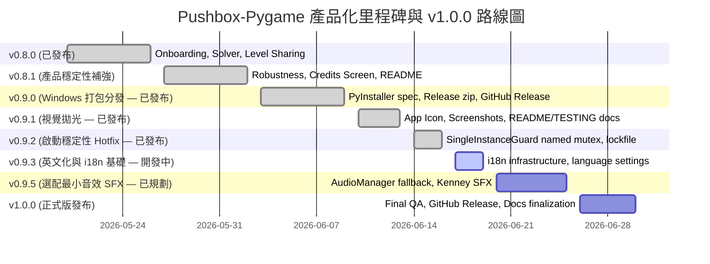

# Pushbox-Pygame Development Guide & Product Roadmap

## 1. Development Guide

### Prerequisites
- Python 3.9+
- `uv` installed (recommended)
- A desktop environment for running Pygame

### Install Dependencies
```bash
uv sync
uv sync --extra dev
```

Fallback (if `uv` is not available):
```bash
python -m venv .venv
.venv\Scripts\activate
pip install -e ".[dev]"
```

### Run the Game
```bash
uv run python main.py
```

### Tests / Lint / Type Check
```bash
# Run unit & integration tests
uv run python -m pytest

# Run ruff check and format check
uv run ruff check .
uv run ruff format --check .

# Run static type checking
uv run mypy src/ --explicit-package-bases
```

### Runtime Data and Caches
- Runtime progress files are stored in `data/progress.json` and `data/config.json`.
- These files are gitignored; default templates live in `src/pushbox/utils/config.py`.
- Local caches are stored in `.pytest_cache/`, `.ruff_cache/`, and `.mypy_cache/`.
- Local environments live in `.venv/`.

### Troubleshooting
- If Pygame fails to initialize, verify you have an active desktop session, or set environment variables to run headless with a virtual display.
- If `uv sync` fails, use the fallback pip install steps above.

---

## 2. Historical Product / UX Audit (v0.6.0)

> [!NOTE]
> This section is preserved as a historical product audit completed in v0.6.0. It serves as valuable context for the project's design and mechanical decisions. Its recommendations have been progressively implemented (such as onboarding levels, smooth undo/redo, and minimap previews). For the active development priorities, please refer strictly to the **Current Roadmap Toward v1.0.0** in Section 4.

### 一、九大體驗面向深度評估（Core UX Audit）

#### 1.1 新手首次進入 App 的體驗完整性
* **現狀評估**：教學畫面原本採用了滿佈按鍵與規則的靜態說明圖，對於沒有推箱子經驗的年輕一代或輕度玩家，可能產生認知負荷，無法快速將視覺資訊轉化為操作直覺。
* **改善建議**：應將靜態圖改為「互動式新手關卡」。

#### 1.2 首頁與功能選單是否清楚易懂
* **現狀評估**：主選單採用了簡潔的暗色系卡片佈局，按鈕對比佳，且具備進度指示（★ 已完成 X / 30 關）。
* **改善建議**：為 `ModernButton` 增加 Hover 時的微互動反饋；主選單背景設計「吸引模式」以播放自動演示或微弱浮動箱子。

#### 1.3 遊戲介紹、主題分類與操作教學是否足夠
* **現狀評估**：專案完全聚焦於純益智幾何解謎，無故事背景包裝，這高度符合經典解謎定位。
* **改善建議**：引進關卡分組主題化（極光冰川、德古拉暗紫、經典綠）配色，並加入微弱激勵思考的關卡加載提示。

#### 1.4 UI 視覺層級與操作流程是否直覺
* **現狀評估**：Dracula/Nord 暗色美學層級劃分十分清晰，通關時的粒子自適應良好。
* **改善建議**：通關時加入精緻的評價動畫，提升勝利反饋的成就感。

#### 1.5 功能切換與頁面導覽是否合理
* **現狀評估**：淡入淡出轉場順暢，暫停與設定切換無縫。
* **改善建議**：解決編輯器與試玩之間的跳轉割裂（加入「一鍵試玩」按鈕），並在編輯器退出時加上未存檔防呆警告。

#### 1.6 是否缺少設定頁、存檔機制、音效控制、提示系統等基礎功能
* **現狀評估**：存檔、設定頁均已備妥，音效控制保留 Stub，然而缺少卡關時的「提示系統」。
* **改善建議**：在後台實作 Sokoban BFS/A* 求解器，並在 HUD 新增「提示 (I)」按鈕提供路徑引導，降低卡關退遊率。

#### 1.7 是否需要加入新手引導（Onboarding）
* **現狀評估**：極度需要，休閒益智遊戲的頭 30 秒決定留存率。
* **改善建議**：將 Level 0 設計為 100% 互動教學引導關，通過動態提示氣泡引導行走、相鄰與推動歸位。

#### 1.8 是否有能提升沉浸感與遊戲感的設計
* **現狀評估**：操作缺乏視覺打擊感，行走、撞牆與推箱動能反饋一致，顯得機械化。
* **改善建議**：撞牆或無效操作時觸發微震動（Screen Shake）；箱子歸位時加入粒子擴散 Spark 特效；Undo/Redo 時時光倒流改用 100ms 短滑動插值。

#### 1.9 App 是否具備「正式產品」而非「功能 Demo」的體驗
* **現狀評估**：核心與設定完全符合標準，但分發、關卡解鎖鏈與致謝名單仍有進步空間。
* **改善建議**：實作 exe 二進位打包與客製化 Icon；加入關卡循序解鎖鏈；新增 Credits 致謝與關於介面。

---

## 3. Completed Productization Work

> [!TIP]
> This section logs all the completed, integrated milestones that successfully transformed Pushbox-Pygame from a prototype into a highly polished casual game. All completed work has been fully covered by unit tests, linted, and type-checked.

### v0.6.0 Completed — 基礎設施與核心體驗優化
- [x] **遊戲設定頁 (Settings Screen)**：實現鍵鼠雙控、暗色玻璃風格、設定即時存檔。
- [x] **自適應動態格線**：解決大型關卡在小解析度視窗下溢出裁剪的問題。
- [x] **場景淡入淡出 (Fade Transitions)**：消除介面切換時的生硬閃爍。
- [x] **首頁進度與版本徽章**：主選單顯示通關進度，Branding 細節化。
- [x] **歷史紀錄對比**：通關顯示「歷史最佳步數/時間」，建立心流激勵。
- [x] **無頭劇本冒煙測試**：確保整個 UI 與 Core 狀態機在各種極端交互下 0 Crash。

### v0.7.0 Completed — 介面反饋、多主題與平滑動畫
- [x] **編輯器「一鍵試玩」按鈕**：側邊欄新增 `Play Test`，支援從當前未存檔網格無縫切換至臨時 PlayState，Esc 一鍵返回。
- [x] **編輯器退出防呆警告**：若關卡被編輯且未儲存，按下 Esc 退出時，彈窗二次確認。
- [x] **無效操作 Screen Shake 震動**：撞牆、推雙箱時觸發棋盤 3-5 像素的極速抖動。
- [x] **箱子歸位粒子爆發**：箱子落入目標點時，在該 Cell 觸發 15 幀綠色發光粒子擴散。
- [x] **首頁「吸引模式」背景**：主選單背景慢速播放半透明的 AI 自動推箱子動畫。
- [x] **多套關卡主題配色包 (Visual Theme Packs)**：實現經典綠、Nord 冰雪藍、Dracula 暗紫等視覺風格的實時切換與渲染。
- [x] **關卡鎖定解鎖鏈**：實作關卡解鎖進度（只有通關前一關，下一關卡片才變為 Active 解鎖狀態）。
- [x] **時光倒流插值平滑**：撤銷 (Z) 與重做 (Y) 時，角色與箱子以 100ms 短動畫平滑滑動，而非瞬移。

### v0.8.0 Released — 智慧提示、互動教學與關卡分享
- [x] **互動式新手引導教學**：由 `LevelManager` 動態載入 5x7 教學關 `"Level 0"`，實施物理隔離，首次啟動強制進入教學，並由 HUD 透明引導，通關後直退選單。
- [x] **後台 BFS 求解提示**：實作 Sokoban 後台求解器（最大防護節點 50,000），按 `I` 鍵即可高亮渲染下一步推動路徑 1.5 秒。
- [x] **自訂關卡 JSON 匯出/匯入**：採用版本控制 Schema，匯出用 `zlib-base64` 封裝。匯入加入 8 點驗證，名稱自動去重與防穿越過濾。
- [x] **Level Selector Previews**: Rewrote the adaptive details panel layout, greatly increasing window-resizing compatibility; adjusted the default resolution to **`1024x768`** so that the Minimap fits perfectly at launch without overlaps.

### v0.8.1 Completed — Release Hardening & Decoupled README
- [x] **Config / Save / Custom Level Corrupted Data Hardening**: Automated save file `.bak` duplicate recovery and safely skipped invalid custom map loads without program crashes.
- [x] **Runtime Path Infrastructure**: Implemented standalone resource vs writable data isolation to ensure full compatibility.
- [x] **README Redesign**: Decoupled player-facing startup details from advanced developer commands to improve usability.
- [x] **Attribution Credits (About Screen)**：Added credits details into the in-game About screen.

### v0.9.0 — Standalone Packaging & Portability (Release Candidate Ready / Current)
* **核心目標與當前狀態**：
  實現一鍵分發，讓非開發者玩家不用安裝 Python、`uv` 或 `pygame`，即可下載壓縮包並流暢執行遊戲。目前已順利完成了 **Phase 1** 至 **Phase 5** 的所有開發、除錯、文件編修與包裝建置工作，產出了純 GUI 視窗模式的 `Pushbox-Pygame-v0.9.0-windows-x64.zip` 發佈包。此版本已成為 **v0.9.0 Release Candidate**，GitHub 線上正式發布與標籤（Tag）仍為 pending 等待最終審查核可。
  
* **已完成任務及技術決策 (Milestones & Technical Decisions)**：
  - [x] **Phase 1: Packaging Infrastructure Completed**: 
    - 確立 `onedir` 資料夾打包策略，確保依賴項可攜式隨行。
    - 完成了穩健且可重現的 PyInstaller `pushbox.spec` 設定。
    - 撰寫了全自動 Windows 打包建置指令指令碼 `scripts/build_windows.py`，支援自動清理工作區、編譯二進位檔、複製靜態元數據（README.md, LICENSE, RELEASE_NOTES.md）並動態生成中文 `quick-start.txt`。
  - [x] **Phase 2: Local Packaged Smoke Test Completed**:
    - 通過從乾淨的解壓縮資料夾中啟動測試。
    - 通過在路徑中包含空格（Space）與中文語系字元（Chinese Characters）的資料夾啟動測試。
    - **運行時存檔與數據隔離**：確立主動數據路由策略，確保運行時寫入的 `data/` 與自訂關卡 `levels/` 全數建立在 EXE 同級資料夾下（即 siblings），而非臨時資源目錄 `_MEIPASS` 或內部 `_internal/` 下，保證 100% 的存檔便攜性與唯讀資產的隔離性。
    - **預防性版權資產下架**：手動完全移除了授權不透明之 `player.jpeg` 圖像資產。代之以優雅、程序化向量繪製的 Player Fallback（procedural bear fallback），渲染穩定且絕不拋出 Crash 例外。
  - [x] **偵錯控制台已關閉並切換為純 GUI**：`pushbox.spec` 中的設定在 Phase 5 正式調整為 `console=False`，經乾淨目錄首航驗證，CMD 黑色終端命令列視窗已被成功隱藏，提供一般玩家極佳的純視窗遊戲體驗。

* **已完成之專案封裝階段回顧 (Completed Packaging Phases)**：
  - [x] **Phase 3: Documentation Update**: 同步更新說明文件，使其完美反映 v0.9.0 正式 Release Candidate 狀態。
  - [x] **Phase 4: Clean Machine / Release Candidate Verification**: 在全新乾淨資料夾與中文空格路徑中成功解壓並驗證首航。
  - [x] **Phase 5: Final Release Prep**: 版本號正式定案為 `0.9.0`，並藉由 `console=False` 純 GUI 模式編譯產出。
  - * [ ] **Git Tag & GitHub Release Assets Publish (Pending / Waiting Review)**: 待最終核可後，打上 `v0.9.0` Git Tag 並將 `Pushbox-Pygame-v0.9.0-windows-x64.zip` 上傳至 GitHub Releases 中。

* **注意事項**：
  - ❌ 此階段**嚴禁**加入新遊戲功能或擴充玩法。
  - ❌ **不要**在此階段同時做 SFX 音效實作，保持 Packaging 邊界清晰。
  - ❌ 運行時的本地存檔（`data/`）、測試自訂關卡（`levels/`）與編譯快取（`build/`, `dist/`）**嚴禁** commit 進 GitHub 倉庫。

---

## 4. Current Roadmap Toward v1.0.0

> [!IMPORTANT]
> This is the only active productization roadmap for the project. The ultimate goal toward v1.0.0 is to **make the game highly reliable, self-contained, and packaging-ready so that general desktop players can download, unpack, and play seamlessly without a Python developer setup.**



### v0.8.1 Completed — Release Hardening & Decoupled README
- [x] **Config / Save / Custom Level Corrupted Data Hardening**: Recovered progress and config settings elegantly from backup files if parsing fails.
- [x] **Runtime Path Infrastructure**: Implemented standalone resource vs writable data isolation to ensure full compatibility.
- [x] **README Redesign**: Decoupled player-facing startup details from advanced developer commands to improve usability.
- [x] **Attribution Credits (About Screen)**: Added credits details into the in-game About screen.

---

### v0.9.0 — Standalone Packaging & Portability (Official Release ✅)
* **核心目標與最終狀態**：
  實現一鍵分發，讓非開發者玩家不用安裝 Python、`uv` 或 `pygame`，即可下載壓縮包並流暢執行遊戲。已順利完成了 **Phase 1** 至 **Phase 5** 的所有開發、除錯、文件編修與包裝建置工作，產出了純 GUI 視窗模式的 `Pushbox-Pygame-v0.9.0-windows-x64.zip` 發佈包。**v0.9.0 已正式發佈至 GitHub Releases**，tag `v0.9.0` 指向 commit `817cca1`。
  
* **已完成任務及技術決策 (Milestones & Technical Decisions)**：
  - [x] **Phase 1: Packaging Infrastructure Completed**: 
    - 確立 `onedir` 資料夾打包策略，確保依賴項可攜式隨行。
    - 完成了穩健且可重現的 PyInstaller `pushbox.spec` 設定。
    - 撰寫了全自動 Windows 打包建置指令指令碼 `scripts/build_windows.py`，支援自動清理工作區、編譯二進位檔、複製靜態元數據（README.md, LICENSE, RELEASE_NOTES.md）並動態生成中文 `quick-start.txt`。
  - [x] **Phase 2: Local Packaged Smoke Test Completed**:
    - 通過從乾淨的解壓縮資料夾中啟動測試。
    - 通過在路徑中包含空格（Space）與中文語系字元（Chinese Characters）的資料夾啟動測試。
    - **運行時存檔與數據隔離**：確立主動數據路由策略，確保運行時寫入的 `data/` 與自訂關卡 `levels/` 全數建立在 EXE 同級資料夾下（即 siblings），而非臨時資源目錄 `_MEIPASS` 或內部 `_internal/` 下，保證 100% 的存檔便攜性與唯讀資產的隔離性。
    - **預防性版權資產下架**：手動完全移除了授權不透明之 `player.jpeg` 圖像資產。代之以優雅、程序化向量繪製的 Player Fallback（procedural bear fallback），渲染穩定且絕不拋出 Crash 例外。
  - [x] **偵錯控制台已關閉並切換為純 GUI**：`pushbox.spec` 中的設定在 Phase 5 正式調整為 `console=False`，經乾淨目錄首航驗證，CMD 黑色終端命令列視窗已被成功隱藏，提供一般玩家極佳的純視窗遊戲體驗。

* **已完成之專案封裝階段回顧 (Completed Packaging Phases)**：
  - [x] **Phase 3: Documentation Update**: 同步更新說明文件，使其完美反映 v0.9.0 正式 Release Candidate 狀態。
  - [x] **Phase 4: Clean Machine / Release Candidate Verification**: 在全新乾淨資料夾與中文空格路徑中成功解壓並驗證首航。
  - [x] **Phase 5: Final Release Prep**: 版本號正式定案為 `0.9.0`，並藉由 `console=False` 純 GUI 模式編譯產出。
  - [x] **Git Tag & GitHub Release Assets Published**: 已打上 `v0.9.0` Git Tag 並將 `Pushbox-Pygame-v0.9.0-windows-x64.zip` 及 `.sha256` 上傳至 GitHub Releases。

---

### v0.9.1 — Visual Polish & Documentation (Official Release ✅)
* **核心目標**：
  為專案補齊高品質的視覺展示素材與詳盡的 release QA 文件，讓 GitHub / README 頁面對外呈現更完整的產品形象，同時為 Windows standalone 打包流程加入自訂桌面應用程式圖標。已正式發佈至 GitHub Releases，tag `v0.9.1` 指向 commit `9a1a97e`。

* **已完成任務 (Completed Milestones)**：
  - [x] **Phase A: Icon / Screenshot Decision Brief**:
    - 確定圖標視覺方案為「Nord geometric bear pushing a crate（幾何小熊推木箱）」。
    - 確定使用 Python/Pygame 程序化生成多解析度 `.ico`，不依賴 Pillow。
    - 確定截圖策略為 3 張最小截圖集合（Main Menu / Gameplay Hint / Level Editor）。
  - [x] **Phase B: Icon Integration (commit `b5c9755`)**:
    - 完成 `scripts/generate_icon.py`：使用 Pygame + Python 標準庫 `struct` 程序化繪製多解析度幾何小熊推木箱圖標。
    - 產出 `src/pushbox/assets/icon/pushbox.ico`（256x256、48x48、32x32、16x16 四種解析度）。
    - 撰寫 `docs/icon-source.md` 完整記錄生成工具、提示詞、日期、後處理步驟與再分發條款。
    - 更新 `pushbox.spec` 嵌入自訂 `.ico`。
    - 更新 `scripts/build_windows.py` 加入圖標存在性前置檢查。
    - 更新版本號至 `0.9.1.dev0` / `v0.9.1-dev`。
    - 更新 `tests/test_about.py` 動態比對 `APP_VERSION`。
  - [x] **Phase C: Screenshot / README / TESTING docs**:
    - 產出 3 張遊戲截圖 PNG：`docs/images/main-menu.png`、`docs/images/gameplay-hint.png`、`docs/images/level-editor.png`。
    - 更新 `README.md`：新增 Visual Showcase 3 欄截圖表格、更新版本徽章至 `v0.9.1`、更新 Features/Roadmap/Requirements 段落以反映 v0.9.1 正式發佈與 Roadmap 規劃。
    - 更新 `TESTING.md`：新增 Section 6 — Packaged Standalone Release Smoke-Test Checklist。
    - 更新 `RELEASE_NOTES.md`：新增 `v0.9.1 — 2026-05-27` 正式條目、更新 v0.9.0 為正式發佈狀態。
    - 更新 `DEVELOPMENT.md`：記錄 Phase B 已完成、Phase C 已完成。
  - [x] **Phase D: Release Prep Candidate Verification**:
    - 版本號統一升級至 `0.9.1` / `v0.9.1`（`pyproject.toml`, `__init__.py`, `constants.py`, `build_windows.py`）。
    - 透過 `uv sync` 同步更新 `uv.lock`。
    - 通過 `pytest`、`ruff`、`mypy` 等所有品質門禁與測試。
    - 執行 `scripts/build_windows.py` 正式本地編譯打包產出 `v0.9.1` ZIP 與 `.sha256`。
    - 順利通過 `TESTING.md` 的 Clean folder 實機 Smoke-Test 與相容性測試，達到 Release-Ready 狀態並推送遠端。

---

### v0.9.2 — Launch Stability Hotfix (Official Release ✅)
* **核心目標**：
  解決玩家回報的「雙擊 Pushbox-Pygame.exe 時可能會開啟多個遊戲視窗」之啟動問題。透過 Win32 Named Mutex 及 Unix flock 鎖定檔案實現零外部依賴的單一實例防護（SingleInstanceGuard），確保同一時間只允許一個遊戲實例在背景安全運行，預防多個實例爭奪讀寫導致設定檔與存檔損毀。已正式發佈至 GitHub Releases，tag `v0.9.2` 指向 commit `94a5626`。

* **開發任務 (Development Milestones)**：
  - [x] **Phase A: Single-Instance Guard Implementation**:
    - 新增 `src/pushbox/utils/single_instance.py` 封裝 `SingleInstanceGuard`。
    - 在 Windows 下呼叫 `CreateMutexW` 及檢查 `ERROR_ALREADY_EXISTS (183)`。使用 `Local\` 命名空間避免權限或多 session 衝突。
    - 對 Unix-like 系統使用 `tempfile` + `fcntl.flock` 實現相容鎖。
    - 任何例外或系統限制均進行防禦性捕獲，Fallback 至 no-op 以保障程式在任何異常環境下都能順利啟動。
  - [x] **Phase B: main.py Integration & Silent Exit**:
    - 在 `main.py` 的進入點 `main()` 最前端嘗試獲取 `SingleInstanceGuard` 實例。
    - 若 `guard.already_running` 成立，使用 `sys.exit(0)` 安靜退出（不彈出多餘警告或 message box），保證純 GUI 打包模式無殘留命令列輸出。
    - 保證第一個實例在退出時安全執行 `guard.close()` 進行鎖釋放。
  - [x] **Phase C: Comprehensive Unit Testing**:
    - 新增 `tests/test_single_instance.py` 單元測試。
    - 模擬 mock 出 Windows ctypes CreateMutexW / GetLastError 行為（ERROR_ALREADY_EXISTS / NULL 失敗 / Exception）以及 Unix-like flock / missing fcntl 相容性。
    - 確保測試套件不受實機 Windows API 或 PyInstaller 打包限制。
  - [x] **Phase D: Standalone Compile & Local Smoke Test**:
    - 提升版本號至 `0.9.2`，跑完 `pytest` / `ruff` / `mypy` 品質門禁。
    - 執行 `scripts/build_windows.py` 打包產出 `Pushbox-Pygame-v0.9.2-windows-x64.zip`。
    - 實機手動重複點擊 EXE 驗證防護，確認 Task Manager 僅保留唯一實例，安靜退出正常。

* **注意事項**：
  - ❌ 音效/BGM/SFX 仍保持 planned/deferred (v0.9.5)。

---

### v0.9.3 — English UI & i18n Foundation (In Development 🚧)
* **核心目標**：
  提供完整英文 UI 與多國語言支持（i18n）。預設為英文，並可在設定選單中即時切換為繁體中文（zh-TW）。
* **開發任務與進度 (Development Milestones & Progress)**：
  - [x] **Phase A: i18n Infrastructure & Config Support (Completed)**:
    - 建立零外部依賴的 Python 字典架構 `src/pushbox/utils/i18n.py`。
    - 組態與設定擴展：`DEFAULT_CONFIG` 中加入 `"language": "en"` 屬性，在 `Config.load()`, `Config.reset_to_defaults()`, `Config.set_language()` 中同步 active i18n state。
    - 實作防禦性的語言格式化、錯誤處理與 English fallback，確保任何異常或未知語言字串絕不引發 Crash。
    - 新增完整的 `test_i18n.py` 與擴充 `test_config.py` 驗證 i18n 與設定檔整合，227 個測試全部通過。
  - [x] **Phase B1: Settings Language Option & Main Menu Localization Refresh (Completed)**:
    - 重構 `main.py` 的 `_setup_menu()` 以使用 `t(...)` 翻譯所有的主選單按鈕文字。
    - 實作「轉場觸發之選單重構」策略：當從設定頁返回主選單時，重構選單按鈕的翻譯，避免每幀重複建立，保證語言切換即時更新。
    - 擴充 `SettingsScreen` 為 7 個選項，於索引 4 插入「語言設定 (Language)」選項，並使用 `Config.set_language(...)` 實時切換與存檔。
    - 重新調優設定卡片高寬與間距（`card_h = 540`, `spacing = 54`, `row_h = 40`），並以一體化、置中對齊的文字 pill-box 渲染主題與語言選取器，避免視覺裁剪。
    - 新增 `tests/test_language_ui.py` 並調整 `tests/test_about.py` 以完整驗證主選單、語言切換、設定排版與 i18n 同步狀態。
  - [x] **Phase B2: About/Tutorial Screens & bottom gameplay buttons UI Localization (Completed)**:
    - 重構 `AboutScreen` 的 `draw()` 方法，以動態 blit 寬度計算（`desc_label.get_width()` 加上間距）取代原硬編碼之大字元偏移量，徹底避免中英文長度不同造成的字串 overlap 裁剪。
    - 重構 `TutorialScreen` 的 `draw()`，將其網格各區域、操作控制與提示 bullets 以 `t(...)` 動態組合形式載入，消除中英文混合狀態。
    - 重構 `main.py` 的 `_init_game_buttons()`，將底部的四個按鈕（撤銷、重設、重做與提示）改用動態 localized 標籤，並在進入 `"game"` 畫面時執行單次語系重構以維護極致流暢性。
    - 新增 3 個針對 About 頁面、Tutorial 頁面與底部按鈕的 localization 整合測試以確保 regression-free，全套 236 個測試高標通過。
  - [ ] **Phase C: Gameplay & Editor UI Localization (Planned)**:
    - 翻譯遊戲內 HUD 狀態（Moves, Pushes, Time, Best, Controls）、Deadlock/Pause 提示、關卡選擇器 (Level Selector) 及關卡編輯器 (Level Editor) 的深層中文字串。

---

### v0.9.5 — Optional SFX / 最小音效系統
* **核心目標**：
  以極低的工程成本為遊戲操作導入必要的清脆短音效，大幅提升 Game Feel，但絕不允許音效系統成為阻礙 v1.0.0 發布的 Blocker。
* **建議任務**：
  1. **只做 SFX（短音效），暫緩 BGM（背景音樂）**：
     - 僅收集並加載以下核心操作音效（格式建議為 `.wav` 以確保高相容性）：
       - `move.wav`：玩家行走步聲
       - `push.wav`：推動箱子時的碰撞摩擦聲
       - `bump.wav` / `invalid.wav`：撞牆或推雙箱時的無效操作悶響
       - `target.wav`：箱子精準歸位到 Target 上時的清脆叮噹聲
       - `undo.wav` / `redo.wav`：時光倒流時的沙沙聲
       - `win.wav`：整關順利通關時的勝利短曲
       - `click.wav`：UI 按鈕點擊反饋聲
  2. **AudioManager 穩健實作與容錯 fallback**：
     - 將音效控制與 `SettingsScreen` 中的 Sound Volume 進行實時連動。
     - Music Volume 的拉桿和配置項予以保留，但音軌暫時置空。
     - **防禦性音訊加載**：如果音訊檔案損毀、遺失或解碼失敗，應以靜音 fallback，**絕不**允許系統拋出 Crash 崩潰。
     - **硬體驅動相容**：若玩家主機的音效卡驅動不健全、`pygame.mixer.init()` 初始化失敗，系統應自動捕獲異常並全面切換至無聲安全模式，遊戲依然可以流暢暢玩。
  3. **版權授權合規管理**：
     - 優先使用 **CC0 / Public Domain（公有領域）** 音效素材。
     * *推薦來源*：Kenney CC0 益智音效包、OpenGameArt / Freesound（必須過濾出標明為明確 CC0 的條目）。
     - ❌ **嚴禁**使用任何授權邊界模糊或標明 "Royalty-free only" 但禁止再分發的網路音效。
  4. **致謝文件同步 (Credits)**：
     - 新增或更新 `CREDITS.md`。
     - 即使使用 CC0 不要求署名，也必須在 `CREDITS.md` 中詳細記錄檔案來源、License 類型、下載原始頁面與檔案原始名稱，以昭公信，保障開源品質。
     - 如果迫不得已使用 CC-BY 資源，必須嚴格依照授權條款要求在關於介面與文件中進行署名；否則，一律只採用 CC0 資源以簡化法規流程。
* **注意事項**：
  - ❌ 背景音樂（BGM）全面暫緩。
  - ❌ **不使用**任何付費音效或來源不明素材。
  - ❌ **不使用**任何會污染 MIT 授權分發的 GPL 授權音效。
  - ⚠️ 音效是 Optional Polish（選配拋光）；若硬體相容或資源尋找耗費過多精力，可果斷延後至 v1.1.0。

---

### v1.0.0 — Release Candidate / 正式版發布
* **核心目標**：
  完成高標準的最終品質驗收，建立 v1.0.0 正式 Tag，在 GitHub Release 發布 Windows 解壓即玩的免安裝包，為廣大解謎愛好者獻上完美休閒作品。
* **建議任務**：
  1. **Final QA（極致化黑箱/白箱驗收）**：
     - 在開發環境下，從乾淨的 `git clone` 啟動，能以 `uv run` 完美執行並通過所有單元測試。
     - 在全新的 Windows 環境下，解壓發布的 Zip 包後雙擊 EXE，能順暢啟動、執行教學、保存進度、載入 30 關卡、順利匯入與匯出分享碼。
     - 整個過程 Console 不應出現任何 Traceback、錯誤或未處理例外。
  2. **正式建立 GitHub Release**：
     - 於 Git 上打上 annotated tag `v1.0.0`。
     - 撰寫專業的 Release Notes，說明 Pushbox-Pygame 的核心亮點（Onboarding、智慧提示、關卡分享碼等）。
     - 上傳 Windows `.zip` 壓縮包至 Release Assets 中。
     - 更新 GitHub `README.md`，使其在開頭即引導玩家下載 Release 可執行檔，並在後半部保留開發者 Setup 指南。
  3. **文件最終同步**：
     - 更新並精簡 `TESTING.md` 的冒煙測試。
     - 更新 `RELEASE_NOTES.md` 的 `v1.0.0` 發布日誌。
     - 確保 `CREDITS.md`、`LICENSE` 條款完全無暇。
* **注意事項**：
  - ❌ `v1.0.0` **嚴禁**加入任何未經測試的大型新功能或大規模重構，一切以穩健、安全、流暢、文檔清晰為首要目標。
  - ⚠️ 若音效（audio）或圖標（icon）因任何原因卡住，**不應**阻塞 v1.0.0 的準時發布，可直接將該部分選配項目延後至 v1.1.0。

---

## 5. Deferred / Not for v1.0.0

為確保 `v1.0.0` 能夠在短期內高規格收尾發布，以下高複雜度或需遠端網路支援的項目**明確列為暫緩**，不在 v1.0.0 考慮範圍內：

* 🌐 **聯機關卡分享 / 伺服器後端 (Online Level Sharing & Server Backend)**：不提供伺服器端帳戶登入與關卡上傳，僅使用本地 `PBX_` 分享碼進行文字傳播。
* ☁️ **雲端存檔同步 (Cloud Save)**：不實作任何雲端存檔功能，存檔與最佳紀錄僅保存在本地 `data/` 中。
* 👤 **帳號與登入系統 (Account & Login System)**：無任何使用者註冊或登入限制，隨開即玩。
* 🏆 **成就系統 (Achievements)**：暫不實作複雜的本地或 Steam 成就解鎖。
* 🗺️ **更多預設關卡 (More Built-in Levels)**：預設關卡穩定維持在 Level 1–30 的 pedagogical 藍圖，不隨意盲目擴增。
* 🎵 **背景音樂 (BGM)**：遊戲中暫不實作背景音樂，僅實作必要的 SFX 短音效。
* 🥞 **場景狀態堆疊重構 (Scene Stack Refactor)**：暫不進行 `GameApp` 扁平場景字串路由的大規模 Scene 堆疊重構，以保持當前架構的高穩定度。
* 🎨 **UI 框架大型重寫 (UI Framework Refactor)**：不使用第三方複雜 UI 庫，維持目前 Pygame 純手工精雕的現代幾何 HSL 配色元件。
* 📱 **行動端 / 網頁端移植 (Mobile & Web Version)**：不進行 Pyjs / Pygbag 網頁分發或 Android 封裝。
* 🎹 **程序化音效合成 (Procedural Audio Synthesis)**：不實作即時波形合成音訊，統一載入靜態音效資源（除非未來有明確技術指標要求）。

---

## 6. Asset and Licensing Strategy

為確保開源 MIT 專案的分發安全，Pushbox-Pygame 將實施最嚴格的資源授權合規管理：

### 6.1 音效 (Audio) 策略
- **授權優先級**：**僅限 CC0 / Public Domain（公有領域）**。
- **推薦來源**：
  - Kenney CC0 益智音效包（Asset packs 中的 puzzle/interface 音效）。
  - OpenGameArt / Freesound（下載前必須過濾並人工核對授權宣告，必須為 Explicit CC0 條目）。
- **合規存檔**：所有使用的音效，必須將原始網址、作者、授權標章與檔案對照記入 `CREDITS.md`。
- **防禦防崩潰**：若硬體音訊初始化失敗或素材丟失，系統必須自動切換為靜音模式，絕不允許引發 Traceback 崩潰。

### 6.2 圖標與圖像 (Icon & Sprite) 策略
- **桌面圖標 (App Icon)**：
  - 允許且推薦使用 AI 圖像生成工具（如 Midjourney、DALL-E 3、Stable Diffusion）生成現代像素幾何風格的 App 圖標。
  - 必須在開發日誌中完整備份 Prompt（提示詞）、生成日期與後續縮放/ICO 轉換工具流程。
  - ❌ **嚴禁**從 Google 圖片或未授權圖庫直接下載使用。
- **遊戲內美術 (In-game Art)**：
  - ❌ **不需要**使用任何 AI 繪製的繁複美術貼圖。
  - 遊戲內將始終保持高質感、簡潔現代的 HSL 配色幾何 Tile 視覺風格，以確保 Dracula / Nord 暗色美學的一致性，防止過度裝飾造成視覺繁雜。

---

## 7. Future Technical Debt / Post-v1.0 Ideas

> [!NOTE]
> This section logs long-term technical enhancements, refactoring plans, and visual ideas designed to clean up technical debt and expand the game engine in post-v1.0 iterations. These ideas are deliberately excluded from the current v1.0.0 release scope.

### 7.1 統一資源與字型管理器 (`FontManager`)
* **現狀問題**：目前 `Menu`、`SettingsScreen`、`Renderer` 等類別在每次實例化或重繪時都單獨調用 `pygame.font.Font()` 從硬碟載入 `.ttf` 文件，造成重複 I/O 與記憶體碎片。
* **技術方案**：
  重構並封裝一個單例（Singleton）或靜態類別 `FontManager`：
  ```python
  class FontManager:
      _fonts: dict[str, pygame.font.Font] = {}
      
      @classmethod
      def get_font(cls, path: str, size: int) -> pygame.font.Font:
          key = f"{path}_{size}"
          if key not in cls._fonts:
              cls._fonts[key] = pygame.font.Font(path, size)
          return cls._fonts[key]
  ```
  這樣可以確保全域字型僅加載一次，大幅提升啟動速度與運行時記憶體穩定性。

### 7.2 場景狀態堆疊（`SceneStateStack`）
* **現狀問題**：`main.py` 的 `GameApp` 藉由一個扁平的 `self.current_screen` 字串變數進行場景路由。當出現「在遊戲中暫停 -> 進入設定 -> 從設定返回暫停 -> 返回遊戲」這種嵌套場景時，扁平字串難以優雅維護前置狀態。
* **技術方案**：
  引入場景堆疊模式（Scene Stack Pattern）：
  - 定義 `Scene` 抽象基底類別，擁有 `handle_events(events)`, `update(dt)`, `draw(screen)` 生命週期方法。
  - `GameApp` 維持一個 `self.scene_stack: list[Scene]`。
  - 暫停或設定時，`self.scene_stack.append(SettingsScene())`（Push）。
  - 返回時，`self.scene_stack.pop()`。
  這能讓轉場動畫、音量淡入淡出、鍵盤焦點管理變得極其解耦與清晰。

### 7.3 遊戲感細節與 Post-v1.0 擴展
- **地面裝飾物**：為各配色包主題實作隨機地面斑駁、花草或冰裂碎紋。
- **程序化音效合成**：探索使用數學正弦波即時生成 `pygame.sndarray` 音訊以消除外部 `.wav` 依賴。
