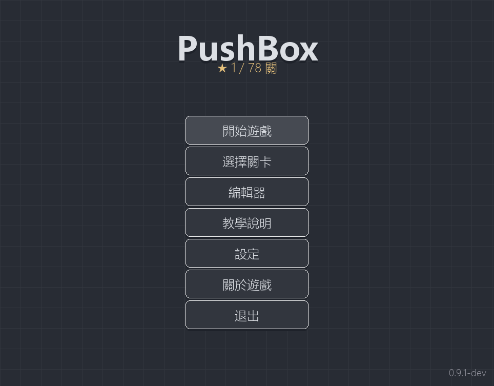
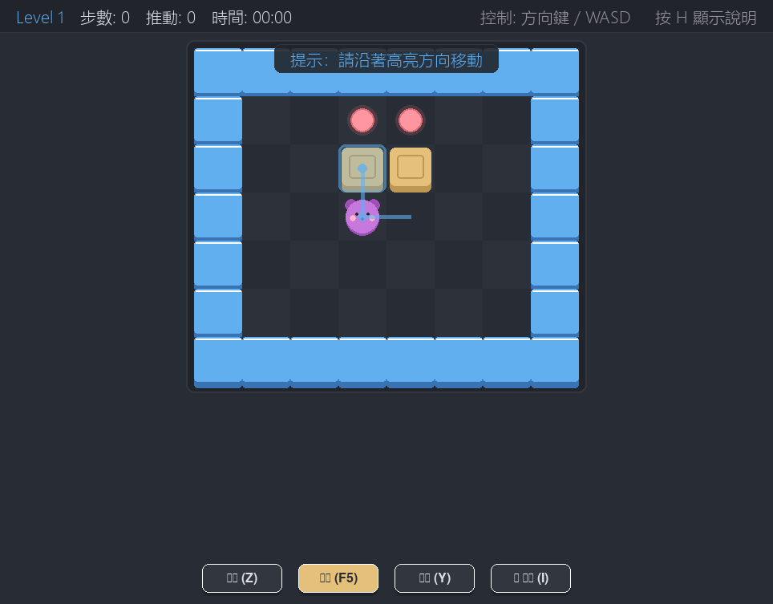
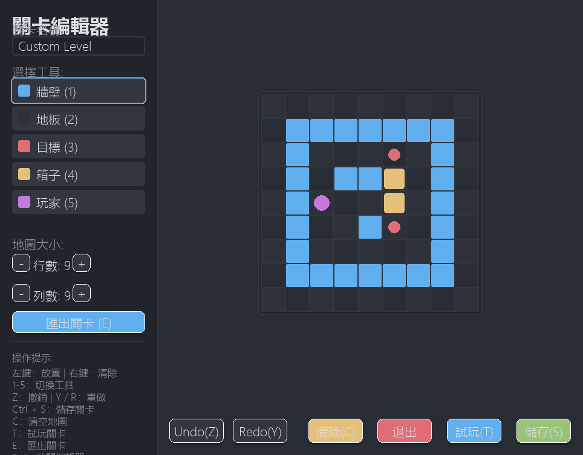

# Pushbox-Pygame

[](#🎮-for-players)
[](#🎮-for-players)
[](LICENSE)
[](#🛠️-for-developers)
[](#🛠️-for-developers)
[](#-roadmap)

## Overview

Pushbox-Pygame is a modern Sokoban puzzle game built with Python and Pygame. It offers a clean, fluid interface, robust keyboard/mouse controls, local progression saving, options and configuration settings, an interactive solver hint system, PBX share code level imports/exports, and a built-in custom level editor.

## Visual Showcase (畫面展示)

| Main Menu (主選單) | Solver Hint (求解提示) | Level Editor (關卡編輯器) |
| :---: | :---: | :---: |
|  |  |  |

---


## Key Features

- **30 Built-in Levels**: High-quality hand-crafted levels of graduating difficulty, complete with difficulty, theme, and box count metadata badges in the Level Selector.
- **Interactive Onboarding (Level 0)**: A tutorial-only 5x7 introductory level automatically triggered on first-launch to guide new players through fundamental walking and pushing mechanics with dynamic instruction banners.
- **AI Solver & Hint Overlay**: Integrated a high-performance BFS shortest-action-path solver displaying a guided breathing path and grid highlight cues.
- **Level Sharing System**: Export custom maps from the editor or import them in the selector using `PBX_` prefixed compressed Base64 codes, guarded by an 8-point defense validation suite.
- **Settings Screen**: Accessible from the main menu or pause overlay, allowing real-time adjustment of screen dimensions, visual theme packs, tutorial flags, and transition animations.
- **Visual Theme Packs**: Real-time hot-swapping between "Nord Blue" (Aurora Ice), "Classic Green", and "Dracula Purple" modern sleek themes.
- **Level Selector**: Fully paginated grid selection displaying completion stars on cards and detailed level stats.
- **Fluid Controls**: Dual-scheme movement (Arrow keys and WASD) with smooth native menus and page navigation.
- **Undo / Redo / Reset**: Infinite-depth undo stack (capped at 100 moves for performance) with full action recovery and level reset capabilities.
- **In-Game Help & Pause Card**: DIM-shaded game pause overlay screen and help guide detailing controls on demand.
- **Stalemate & Deadlock Detection**: Real-time deadlock monitoring and immediate "死鎖!" card overlay feedback when a puzzle enters an unsolvable state.
- **Level Editor**: Built-in interactive map canvas supporting tool pickers (1-5), paint/erase, undo/redo, dynamic resizing (5x5 to 20x20), and canvas validation prior to local storage.
- **About / Credits Screen**: In-game credits screen displaying project version, license details, and open-source contributions.
- **Config / Save Hardening**: Bulletproof local save resilience with automatic `.bak` backups and active data integrity guards.
- **Runtime Path Helpers**: Pre-wired path resolution routing for Windows standalone packaging readiness.
- **Custom App Icon (v0.9.1)**: Incorporated a beautifully custom-coded **Nord geometric bear pushing a crate** icon (`pushbox.ico`) into the PyInstaller packaging pipeline.

---

## 🎮 For Players

### Current Status

> [!IMPORTANT]
> **Windows Standalone Package (v0.9.5 Official Release) is now available!**
> The Windows `onedir` standalone packaging pipeline has been officially released, and compiled in pure GUI windowed mode (`console=False`). Standalone ZIP packages are officially published on GitHub Releases.
> 
> **Verified Smoke Test Scenarios:**
> - Clean extraction and execution from empty folders.
> - Execution from directory paths containing spaces and Chinese characters.
> - Pure GUI windowed mode execution with **no terminal command console (CMD) windows appearing**.
> - Automated runtime sibling creation of `data/` (saves, configurations) and `levels/` (custom editor levels) next to the executable for absolute save file portability.
> - Procedural vector player character (procedural bear fallback) rendering works reliably and beautifully without requiring external `player.jpeg` image files.
> - **Single-Instance Protection**: A ctypes Win32 named mutex ensures that repeatedly launching the executable only opens a single game window. Any additional instances exit silently.
> - **Optional SFX Support**: Implemented a defense-in-depth gameplay SFX system powered by lightweight procedurally generated CC0 wave sounds, completely optional and safe against driver initialization errors.
> 
> *The stable release is **v0.9.5**, which features an optional procedural CC0 SFX audio system, comprehensive English and Traditional Chinese localization, a premium custom-designed desktop application icon, and single-instance guard launch protection.*

### How to Run the Packaged Version

1. **Obtain the ZIP archive**: Acquire the standalone package `Pushbox-Pygame-v0.9.5-windows-x64.zip` (generated via the official local build pipelines).
2. **Extract it**: Extract the ZIP file completely to any directory on your computer (e.g., `C:\Games\Pushbox-Pygame\`).
3. **Run the executable**: Double-click `Pushbox-Pygame.exe` inside the extracted folder to start playing!
   - *Note on SmartScreen*: Since the executable is compiled via PyInstaller and is unsigned, Windows Defender / SmartScreen may display an "Unknown Publisher" warning on first run. This is safe and normal. Click **"More info"** and then **"Run anyway"** to launch.
   - *Portability*: On first launch, the game automatically creates `data/` and `levels/` directories in the **same directory** as the executable, ensuring 100% portability.

### How to Run from Source for Now

To play the game, make sure you have **Python 3.9** (or newer) installed on your system.

1. **Clone or Download** this repository.
2. **Open a terminal** in the project root directory.
3. Install dependencies and start the game:
   ```bash
   # If using uv (recommended):
   uv run python main.py

   # If using standard Python virtual environment:
   python -m venv .venv
   # Windows:
   .venv\Scripts\activate
   # macOS/Linux:
   source .venv/bin/activate
   pip install -e .
   python main.py
   ```

### Controls

| Category | Action | Key Shortcut | Notes / Interactions |
| --- | --- | --- | --- |
| **Global** | Quit Game | `Ctrl+Q` | Closes the application instantly from any screen |
| **Main Menu** | Navigation | `↑` / `↓` / `W` / `S` | Moves menu selection button highlights with visual feedback |
| | Activation | `Enter` / `Space` | Triggers the highlighted menu item action |
| **Selector** | Navigation | Arrow keys or `WASD` | Moves selectors in a 3x3 grid; auto-flips pages at bounds |
| | Prev Page | `PageUp` or `Shift+Tab` | Flips back to the previous page of levels |
| | Next Page | `PageDown` or `Tab` | Flips forward to the next page of levels |
| | Import Level | `I` button (bottom) | Triggers the Import dialog for custom PBX codes |
| | Activation | `Enter` / `Space` | Selects and launches the highlighted level |
| | Return to Menu | `Esc` | Exits the selector back to the main menu screen |
| **In-Game** | Movement | Arrow keys or `WASD` | Moves the player character on the board |
| | Action Hint | `I` | Triggers AI solver to show the next critical steps |
| | Undo Move | `Z` or `Backspace` | Reverts the last player step or box push (up to 100 steps) |
| | Redo Move | `Y` or `R` | Re-applies the last undone step |
| | Reset Level | `F5` or `Delete` | Reverts the map to its starting state and resets timer |
| | Toggle Help | `H` or `F1` | Shows/hides the in-game control guide overlay card |
| | Dismiss Help | Any keypress | Immediately hides the help overlay card |
| | Pause Game | `Esc` or `P` | Enters pause mode; blocks inputs and freezes game timer |
| **Pause Screen**| Resume | `Esc` or `P` | Exits pause mode and resumes timer |
| | Restart | `R` | Restores starting map state and exits pause mode |
| | Menu Exit | `M` | Returns to the main menu |
| **Win Screen** | Next Level | `N` | Proceeds directly to the next level in sequence |
| | Restart | `R` | Restarts the current level to try for a better record |
| | Menu Exit | `M` | Returns to the main menu |
| **Stalemate** | Undo | `Z` or `Backspace` | Reverts the deadlock-inducing move to keep playing |
| | Restart | `R` or `F5` | Restarts the level |
| | Menu Exit | `M` | Returns to the main menu |
| **Level Editor**| Select Tool | `1` - `5` | Selects drawing tiles: Wall (1), Floor (2), Target (3), Box (4), Player (5) |
| | Mouse Draw | `Left Click` | Paints the selected tile onto the targeted grid cell |
| | Mouse Erase | `Right Click` | Clears/erases the targeted grid cell |
| | Undo Paint | `Z` | Undoes the last canvas modification step |
| | Redo Paint | `Y` or `R` | Redoes the last undone canvas modification step |
| | Clear Grid | `C` | Clears the entire drawing grid to start fresh |
| | Export Level | `E` | Generates a custom PBX share code to clipboard |
| | Save Map | `Ctrl+S` | Validates map layout rules and saves local custom level |
| | Exit Editor | `Esc` | Exits the editor and returns to the main menu |

### Custom Level Sharing Quick Guide

1. **Creating a level**: Go to the **Level Editor** from the main menu, paint your map, make sure it has exactly one player, and equal counts of boxes and targets.
2. **Exporting**: Click the `Export Level` button (or press `E`). A `PBX_` share code will be copied to your clipboard.
3. **Importing**: In the **Level Selector**, click `匯入關卡` (or press `I`). Paste your code to play custom levels immediately.
4. *Note*: **PBX_ sharing is a local text-code / clipboard exchange format, not an online level server.** No online server or network database is used.

---

## 🛠️ For Developers

### Prerequisites

- **Python**: `>=3.9` (matching configuration in `pyproject.toml`)
- **uv**: A fast Python package installer and manager (recommended).

### Setup

Clone the repository and synchronize the environment:

```bash
# Sync standard dependencies (Pygame, NumPy)
uv sync

# Sync development tools (pytest, ruff, mypy)
uv sync --extra dev
```

### Run the Game

Launch the application using `uv`:

```bash
uv run python main.py
```

### Test / lint / type check

Ensure code quality and run the automated test suite locally:

```bash
# Run the complete test suite (200+ tests)
uv run python -m pytest -v

# Run Ruff linter checks
uv run ruff check .

# Check Ruff formatting styling
uv run ruff format --check .

# Validate MyPy strict static typing
uv run python -m mypy src/ --explicit-package-bases
```

### Build Windows Standalone Package

To compile and package the game yourself on a Windows machine:

```bash
# Sync dependencies including PyInstaller (via build extra)
uv sync --extra build

# Run the automated build script
uv run python scripts/build_windows.py
```

This will compile the game using `pushbox.spec` in `onedir` mode, copy all required documentation, generate a `quick-start.txt` guide, and create a ZIP archive in the `release/` folder alongside its SHA256 checksum.

---

## Project Structure

```
pushbox/
├── main.py
├── pyproject.toml
├── README.md
├── TESTING.md
├── DEVELOPMENT.md
├── AGENTS.md
├── LEVEL_DESIGN.md
├── LEVEL_21_25_PLAN.md
├── RELEASE_NOTES.md
├── src/pushbox/
│   ├── controllers/
│   │   ├── game_controller.py
│   │   └── input_handler.py
│   ├── models/
│   │   ├── game_state.py
│   │   ├── level.py
│   │   ├── save_manager.py
│   │   └── solver.py
│   ├── utils/
│   │   ├── audio.py
│   │   ├── config.py
│   │   ├── constants.py
│   │   ├── level_share.py
│   │   └── paths.py
│   └── views/
│       ├── level_editor.py
│       ├── renderer.py
│       └── ui_components.py
├── tests/
│   ├── test_about.py
│   ├── test_game.py
│   ├── test_game_state.py
│   ├── test_input.py
│   ├── test_level.py
│   ├── test_level_share.py
│   ├── test_level_share_ui.py
│   ├── test_pause.py
│   ├── test_paths.py
│   ├── test_save_manager.py
│   └── test_solver.py
├── data/
└── examples/
```

---

## Configuration and Runtime Data

All user settings, progressions, high scores, and custom maps are stored locally and are excluded from git tracking:
- **`data/config.json`**: Standard settings (active visual theme, show_tutorial, screen resolution).
- **`data/progress.json`**: List of completed level names.
- **`data/scores.json`**: Level speedruns and push counts leaderboard.
- **`data/*.bak` repair backups**: Automated robust `.bak` backup files for progress and scores. In case of unexpected file corruption or parse failures, the system recovers data dynamically from these backup duplicates.
- **`levels/*.json`**: Custom levels exported and saved from the Level Editor.

> [!NOTE]
> The `data/` and `levels/` directories are dynamically created at runtime in the active workspace. When operating in future **packaged mode (.exe)**, all runtime configurations are saved relative to the directory containing the executable rather than internal temporary resource directories, maintaining full user save portability.

---

## Roadmap

- **v0.8.1**: Completed. Release hardening (paths refactoring, config/save robustness, About screen, decoupled README).
- **v0.9.0 (Official Release)**: Standalone Windows packaging infrastructure completed under pure GUI mode (`console=False`). Standalone ZIP packages officially published on GitHub Releases.
- **v0.9.1 (Official Polish Release)**: Complete Visual Showcase gallery, detailed release smoke-test checklists, PyInstaller pipeline upgrades, and an elegant custom **Nord geometric bear** desktop application icon (`pushbox.ico`).
- **v0.9.2 (Launch Stability Hotfix)**: Fixed repeated executable launches opening multiple game windows via a ctypes Win32 named mutex. Second instance exits silently.
- **v0.9.3 (Traditional Chinese Localization)**: Added comprehensive English and Traditional Chinese localization across core UI screens and persisted language settings.
- **v0.9.5 (Official SFX Release ✅)**: Implemented an optional procedurally generated CC0 gameplay sound effects framework (move, push, bump, target, undo, redo, and win).
- **v1.0.0 (Planned)**: Stable official player-facing release.
- **Future BGM (Deferred)**: Ambient background music may be planned as a post-v1.0.0 addition.

---

## Requirements & Limitations

- **Official Windows Package Ready**: A standalone Windows executable package (`Pushbox-Pygame.exe`) is officially published and supported; running directly from Python source code continues to be fully supported as well.
- **Custom Desktop App Icon Included**: The main branch now incorporates a beautifully custom-coded **Nord geometric bear pushing a crate** desktop application icon (`pushbox.ico`).
- **Optional Gameplay SFX**: Built-in 100% license-safe CC0 wave sound effects synthesized directly within the project. The system is designed to degrade gracefully (silent fallback) if the audio hardware is unavailable.
- **Background Music (BGM) is deferred**: Ambient BGM is not implemented in v0.9.5. AudioManager keeps background audio deferred to prioritize stable core puzzle features.
- **PBX_ sharing is local only**: Custom levels are shared by transferring text codes manually; no central server hosting is present.
- **BFS Solver Shortest Action Path**: The solver provides a BFS shortest action path hint, not necessarily the minimum push-count solution. The search budget is capped at `50,000` nodes to keep the game UI responsive.

---

## Contributing

Contributions, bug reports, and features are welcome! Feel free to open issues or pull requests.

## License

This project is licensed under the **MIT License**. See [LICENSE](LICENSE) for details.

## Credits / Acknowledgements

- **Python & Pygame**: For the robust game engine framework.
- **Open-source community**: Contributors and supporters of standard Python game architectures.
- *External Asset Credits*: Will be fully documented in this section before the official player-facing release. All external image assets (such as `player.jpeg`) have been removed for absolute open-source licensing compliance, transitioning to an elegant, procedurally drawn vector player character.
